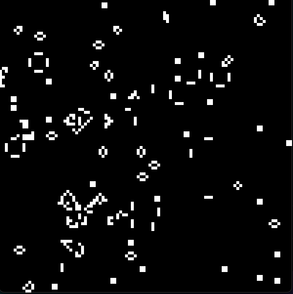

# The Game of Life

Conway's Game of Life in Go



## What is Conway's Game of Life?

The Game of Life (GoL) is a cellular automaton devised by the British mathematician John Horton Conway in 1970. It's a zero-player game, meaning its evolution is determined by its initial state, requiring no further input. The game consists of a grid of cells, each of which can be in one of two states: alive or dead. The state of the grid evolves through a series of steps according to a set of simple rules:

## The purpose and utility of Conway's Game of Life:

Conway's Game of Life is not just a simple game, but a model for simulating the emergence of complexity. Despite its simple rules, it demonstrates how complex patterns and behaviors can emerge from simple initial conditions. This has made it a tool for research and study in various fields including mathematics, computer science, biology, and physics.

In particular, it has been used to explore cellular automata, self-replication, emergent behaviors, and even theoretical computing. The game has inspired numerous investigations into the study of complex systems, and it's often used as an example to illustrate complexity theory and algorithm design.

Key Concepts and Real-World Applications:
- Emergent Behavior: Small sets of rules can lead to complex, unpredictable results. This mirrors the behavior of many natural systems, where complex patterns emerge from simple local interactions.
- Self-replication: Conway's Game of Life is capable of producing "gliders" and other structures that move across the grid, as well as replicating themselves under certain conditions.
- Simulation of Biological Processes: The game has been used as a model for simulating cellular processes and biological systems, showing how simple rules can mimic life-like processes, including reproduction, death, and interaction between organisms.

## Rules of the Game

- **Birth**: A dead cell with exactly three live neighbors becomes a live cell.
- **Survival**: A live cell with two or three live neighbors remains alive; otherwise, it dies.
- **Death**: A live cell with fewer than two live neighbors dies (underpopulation), and a live cell with more than three live neighbors dies (overpopulation).

The game progresses by applying these rules to every cell on the grid at each step. This creates complex patterns and behaviors from simple initial conditions.

## How to run

To run the Game of Life simulation in Go, make sure you have Go installed. Then, use the following command:

```bash
make
```

This will execute the program and start the simulation.